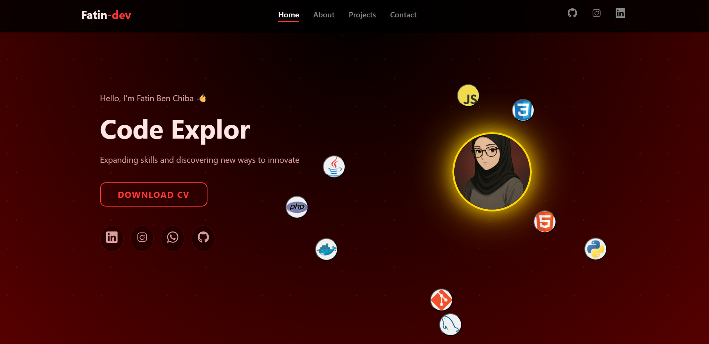

# Fatin-dev Portfolio

## 🌟 Welcome to My Portfolio

Hello, I'm Fatin Ben Chiba 👋  
**IT Systems Student | Development Focus**

---

### 🚀 Problem Solver  
*Expanding skills and discovering new ways to innovate*

---

## 🎯 About This Portfolio

A modern, responsive portfolio website showcasing my journey as an IT Systems student with a strong focus on development. Featuring smooth animations, interactive elements, and a professional design that highlights my technical skills and projects.

---

## ✨ Features

- **🎨 Responsive Design** - Perfectly adapted for all devices
- **⌨️ Typing Animation** - Dynamic text effect in hero section
- **🪐 Interactive Tech Orbit** - Animated circular display of technologies
- **⚡ Smooth Scrolling** - Seamless navigation between sections
- **📱 Mobile-Friendly** - Hamburger menu for mobile devices
- **📧 Contact Form** - Integrated with EmailJS for direct communication
- **🎭 Scroll Animations** - Elements appear on scroll with slide effects

---

## 🛠 Tech Stack

### Frontend
- **HTML5** - Semantic markup and structure
- **CSS3** - Modern styling with animations and responsive design
- **JavaScript (ES6+)** - Interactive functionality and dynamic content

### Technologies Displayed

---

## 🚀 Live Demo

You can view the portfolio online here:  
**[Live Demo](https://fatinbenchiba.github.io)**  

## 📫 Let's Connect

